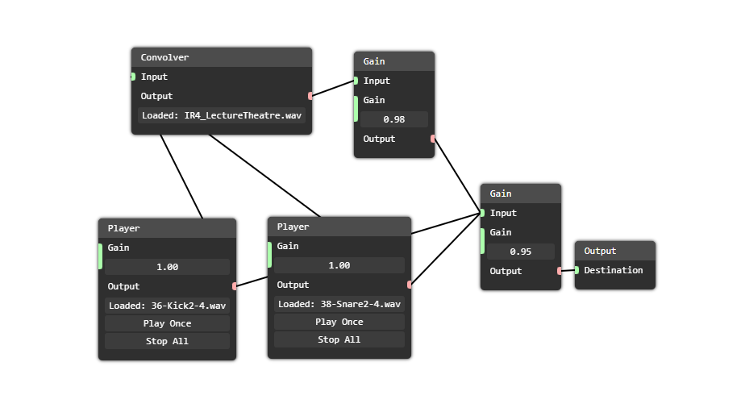

# Nodes
Nodes programming thing

## What is this?
Have you ever wanted to make procedural textures system or simply making audio? This module contains the nodes system and editor so you can intergrate it in your webapp.



## Features (sort of...)
- No dependencies!
- Includes Web Component editor (``<nodes-editor>`` tag)
- Ability to export to and import from external object (JSON for example)

## Example
```ts
import * as nodes from "@nahkd123/nodes";

// Create a connector
class MyConnector extends nodes.Connector {

    inputType = nodes.SLIDERS;
    userInput = [0];
    outputOverride: () => number;

    get actualValue() {
        if (this.outputOverride) return this.outputOverride;
        if (this.connectedFrom.length != 0) {
            let sum = 0;
            this.connectedFrom.forEach(v => {
                if (v instanceof MyConnector) sum += v.actualValue;
            });
            return sum;
        }
        return this.userInput[0];
    }

}

// Create a node
class MyNode extends nodes.Node {

    name = "My Node";
    description = "Invert input!";

    // You can have unlimited inputs and outputs
    inputs = [
        new MyConnector("input", "Input Connector")
    ];
    outputs = [
        new MyConnector("output", "Output Connector")
    ];

    constructor() {
        super();
        this.outputs[0].outputOverride = () => {
            return -this.inputs[0].actualValue;
        };
    }

}

// Don't forget to register your node!
// This part is required if you're willing to import/export nodes network
nodes.NodesRegistry.register("myNode", MyNode);
```

```ts
// Connector usages
let connector1: MyConnector;
let connector2: MyConnector;
let connector3: MyConnector;

// ...
connector1.connect(connector3);
connector2.connect(connector3);

// Sum of connector1 and connector2
console.log(connector3.actualValue);
```

```ts
// Nodes preset usage
// Presets allow you to group nodes, export it as object (which can be converted to
// JSON) to import it later.

let preset = new nodes.NodesPreset();
let node1 = new MyNode();
preset.addNode(node1);

let node2 = new MyNode();
preset.addNode(node2);

node1.outputs[0].connect(node2.inputs[0]);

// Export and import
let json = JSON.stringify(await preset.getAsJSON());
let cleanPreset = new nodes.NodesPreset();
await cleanPreset.loadFromJSON(JSON.parse(json));

console.log(cleanPreset.nodes[0].outputs[0].connectedTo);
```

```ts
// Nodes editor usage
// The editor defined as Web Component, which can be created with
// document.createElement or <nodes-editor> HTML tag

let editor = document.createElement("nodes-editor");
editor.preset = preset;

// You will have to add "Add Node" button outside the editor.
```

## Advanced Nodes
Nodes can have static values (values that can't be modified directly with connectors). There're 2 things that you have to add: ``storeDataTo() + loadDataFrom()`` and ``initNodeElement()``:

```ts
class MyNode extends nodes.Node {

    // ...

    async storeDataTo(json: nodes.NodeJSON): Promise<void> {
        json["type"] = this.something.type;
    }

    async loadDataFrom(json: nodes.NodeJSON): Promise<void> {
        this.something.type = json["type"];
    }

    // initNodeElement: Custom controls
    initNodeElement(e: nodes.NodeElement): void {
        let input = e.addInput(this.something.type);
        input.addEventListener("keyup", () => {
            this.something.type = input.textConent;
        });
    }

}
```